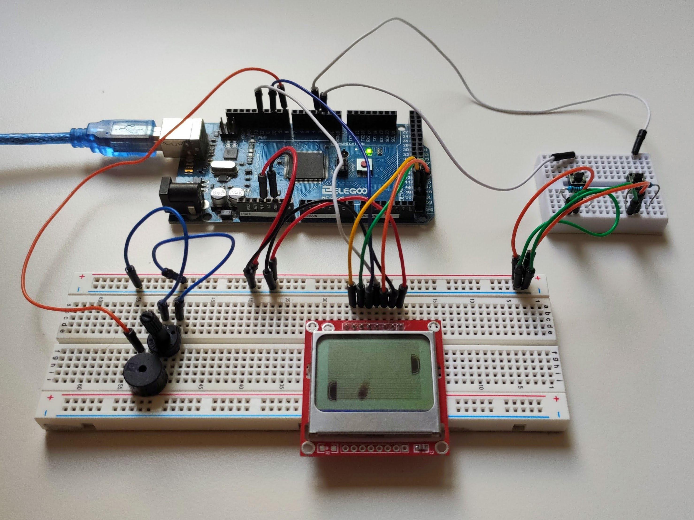
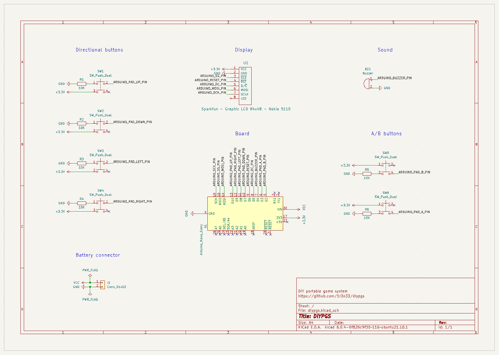
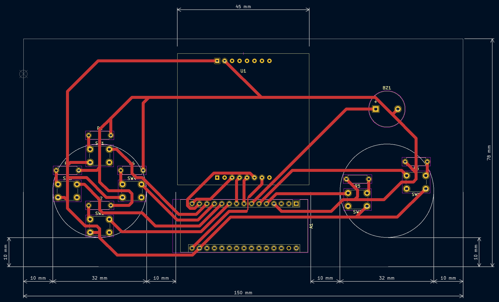
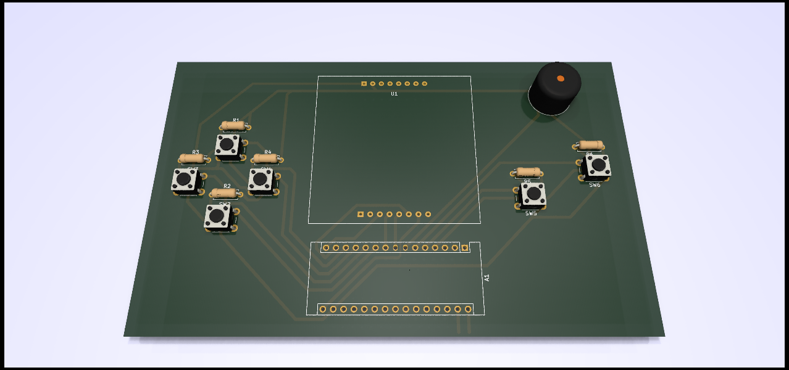

# diypgs 🎮

The DIY portable game system.

# Electronics (schematics, PCB) 🪛🧰

Easy, cheap, and Arduino based...

### 👉 [**Making of the 1st board explained with pictures!**](./make/README.md) 📷

---

# Software (development kit & games) 🧑‍💻🤖

Develop your own games with provided SDK and example!

# 3D printing (case) 🚧👷

TBD

# Shop 🛒💸

If you are interested in getting one, please contact icaroulle+diypgs@gmail.com.
