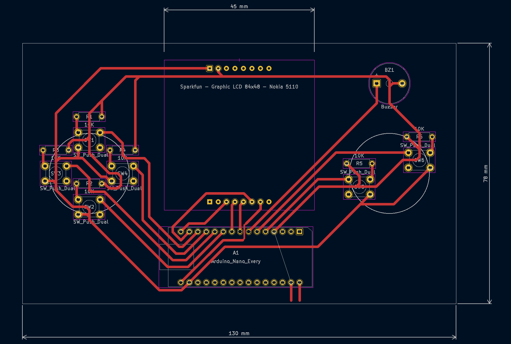
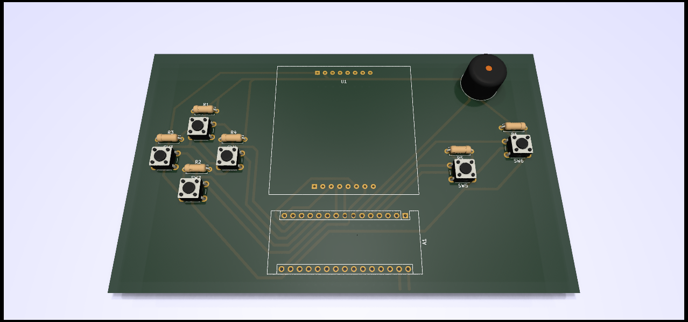

# diypgs

The DIY portable game system.

# Electronics (schematics, PCB)

Easy, cheap and Arduino based...

# Software (development kit & games)

Develop your own games!

# 3D printing (case)

TBD
