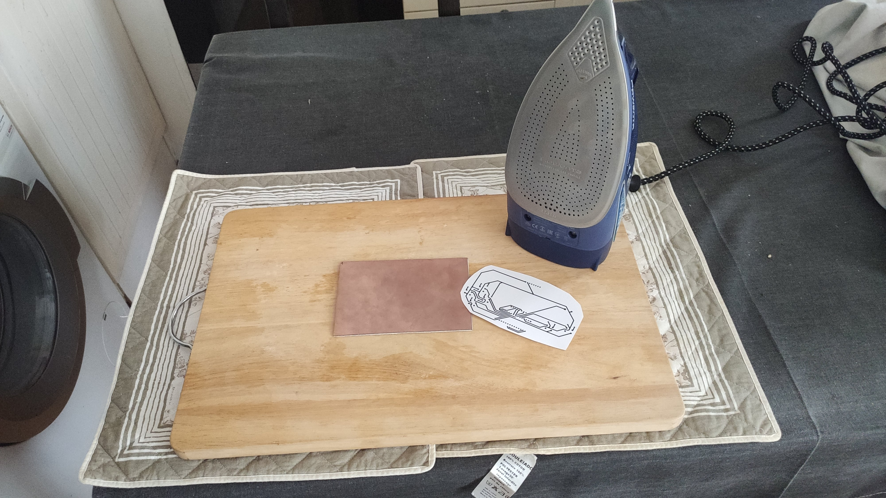
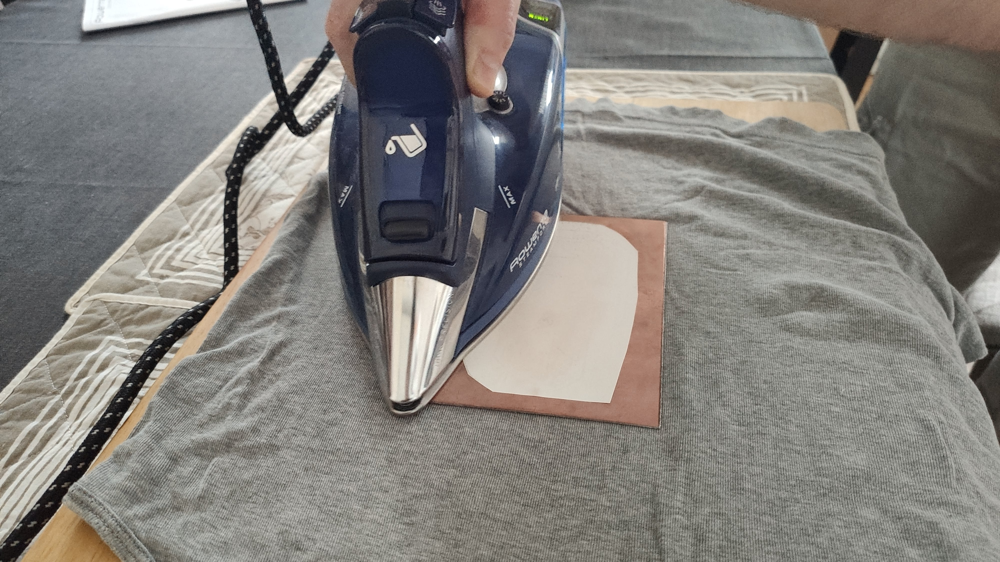
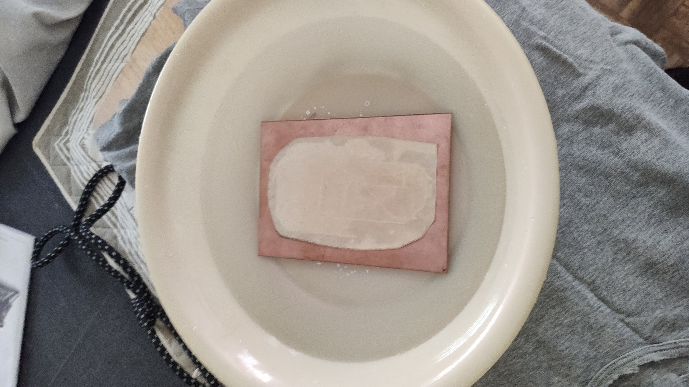
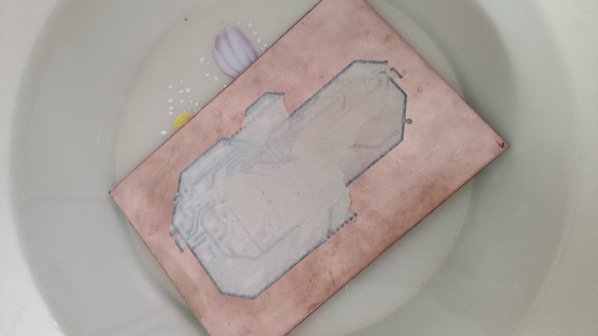
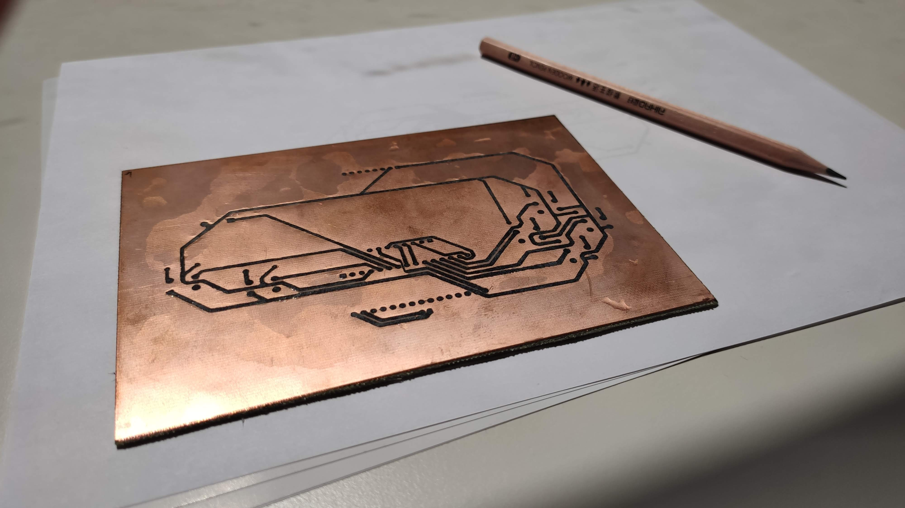
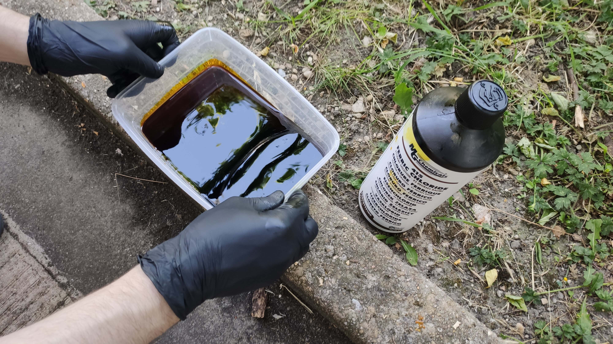
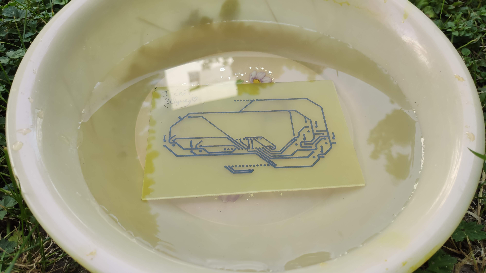
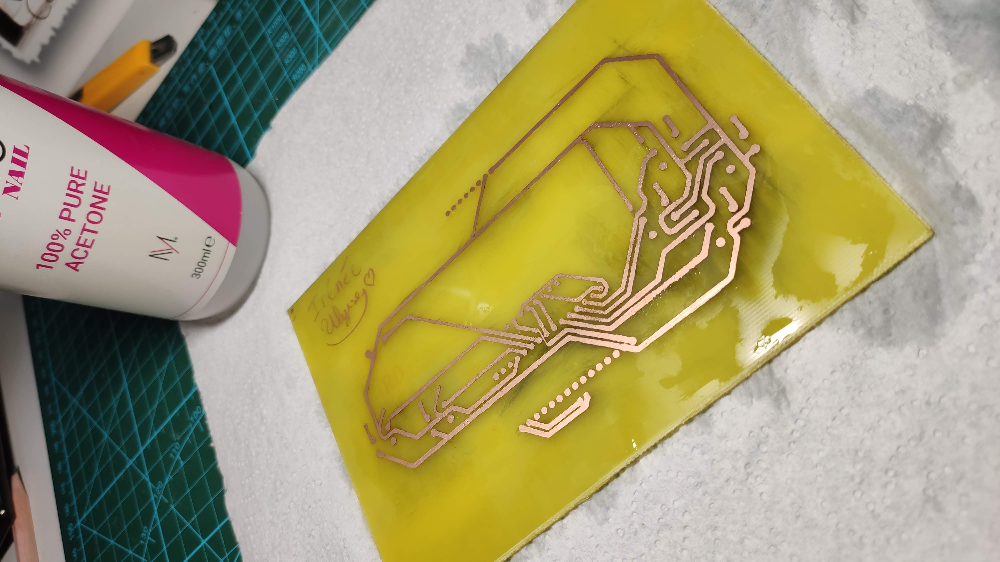
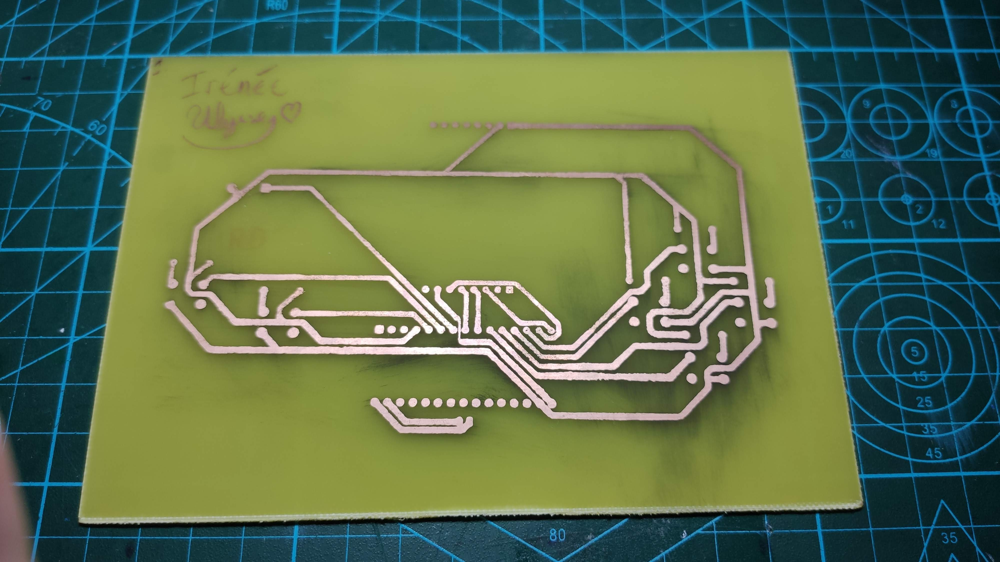

# Making your own PCB

## Toner transfer

PCB circuit layer laser printed on glossy paper:  

Maximum heat and apply strong pressure to transfer toner (5 min.):

Water bath to remove the paper (10 min.):

Peel the paper gently:

Toner acts as a mask when chemically removing the copper:

## Etching

Bath the PCB in ferric chloride and gently agitate the solution in a well ventilated area (45 min.):

Wash many times in water:

## Cleaning

Remove toner with acetone in a well ventilated area:

Ready to be tested:

